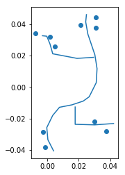
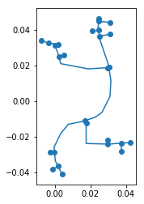

[](https://snkit.readthedocs.io/en/latest/?badge=latest)
[](https://travis-ci.com/tomalrussell/snkit)
[](https://opensource.org/licenses/MIT)
[](https://pypi.org/project/snkit/)
<!--
TODO: enable after publication
[](https://anaconda.org/conda-forge/snkit)
-->

# snkit - a spatial networks toolkit

/ˈsnɪkɪt/ – sounds like [snicket](https://en.oxforddictionaries.com/definition/snicket) (noun,
Northern English) A narrow passage between houses; an alleyway.


## Why use snkit?

`snkit` helps tidy spatial network data.

Say you have some edges and nodes (lines and points, connections and vertices). None of them
are quite connected, and there's no explicit data to define which node is at the end of which
edge, or which edges are connected.

For example:



`snkit` has methods to:
- add endpoints to each edge
- connect nodes to nearest edges
- split edges at connecting points
- create node and edge ids, and add from_id and to_id to each edge


### Spatial network

The output of a snkit data cleaning process might look something like this:




#### Nodes

geometry | id | other attributes...
---------|----|--
`POINT (0.03 0.04)` | node_0 | ...
`POINT (0.03 0.03)` | node_1 | ...
`POINT (0.02 0.03)` | node_2 | ...


#### Edges

geometry | id | from_id | to_id | other attributes...
---------|----|---------|-------| --
`LINESTRING (0.04 -0.04...` | edge_0 | node_10 | node_22 | ...
`LINESTRING (0.01 -0.03...` | edge_1 | node_22 | node_21 | ...
`LINESTRING (0.02 -0.02...` | edge_2 | node_21 | node_25 | ...


## Getting started

Install system libraries (only tested on Ubuntu):

    sudo apt-get install -y libspatialindex-dev libgeos-dev gdal-bin

Or use [conda](https://docs.conda.io/en/latest/miniconda.html) to install major dependencies:

    conda install pandas geopandas shapely rtree fiona

Install or upgrade `snkit` using pip:

    pip install --upgrade snkit

See the [demo
notebook](https://github.com/tomalrussell/snkit/blob/master/notebooks/snkit-demo.ipynb) for a
small demonstration.


## Testimonials 💯 👍 😊

> With five lines of snkit I replaced four or five hundred lines of custom code!

A. Contented Customer (@czor847)


## Related projects

- [`pysal/spaghetti`](https://pysal-spaghetti.readthedocs.io/en/latest/index.html) has methods
  for building graph-theoretic networks and the analysis of network events.
- [`osmnx`](https://osmnx.readthedocs.io/en/stable/) lets you retrieve, model, analyze, and
  visualize street networks from OpenStreetMap, including methods to correct and simplify
  network topology.


## Acknowledgements

```
MIT License

Copyright (c) 2018 Tom Russell and snkit contributors
```

Initial snkit development was at the [Environmental Change Institute, University of
Oxford](http://www.eci.ox.ac.uk/) within the EPSRC sponsored MISTRAL programme, as part of the
[Infrastructure Transition Research Consortium](http://www.itrc.org.uk/).
